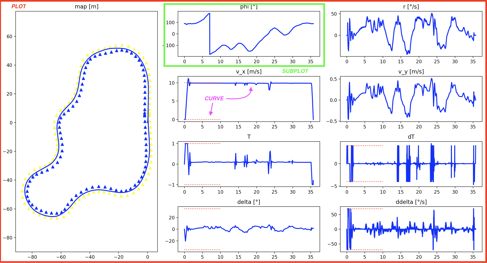

# data_visualization

[](https://github.com/psf/black)

A simple [matplotlib](https://matplotlib.org/)-based utility library for visualizing data in control simulations and
more.

The main features of this library are grouped in the `Plot` class which represents a matplotlib window with multiple
subplots displaying data.
You can add several types of data in each subplot and can easily create animated plots and save them to a video file.
You can find in the sections below a high-level overview of the library's features and concepts. Please refer to the
docstrings of the classes and functions for more details.

# Installation
Simply install it with pip:
```bash
pip install git+https://github.com/EPFL-RT-Driverless/data_visualization.git@<desired_version>#egg=data_visualization
```
where `<desired_version>` is the tag of the desired version (e.g. `v2.0.0` or `main` for the latest version).
To develop the package, follow the instructions of the
[Notion guide](https://www.notion.so/epflrt/How-to-work-at-the-EPFL-Racing-Team-c9d1f06a81854c628b38d4107eac624e).

# Basic usage

The `Plot` class is the main class of the library. It represents a matplotlib window with multiple _subplots_.
It is first constructed as an empty grid (leveraging matplotlib's
[`Gridspec`](https://matplotlib.org/stable/api/_as_gen/matplotlib.gridspec.GridSpec.html)) that the user can
populate with the `Plot.add_subplot()` method in a declarative fashion. This method let you specify where the
subplot is
located on the grid (it can occupy several cells of the grid to create subplots of different sizes) and declare
the _curves_ that it will contain. This hierarchy _plot > subplot> curve_ is represented in the following image:


In data_visualization, you can highly customize all the data you specify. Most of the customization options are
described by four enum classes : [`PlotMode`](#plotmode), [`SubplotType`](#subplottype), [`CurveType`](#curvetype) and
[`CurvePlotStyle`](#curveplotstyle). They are described in the following sections.

Once the plot is created and the data specified, you can actually plot it with the method `Plot.plot()` that optionally
saves the plot to an image file in static mode or to a video file in animated modes (see details
[below](#create-a-video-file-from-a-dynamic-plot).

## `PlotMode`
This option is specified at the plot level and defines three different operating modes:
- **Static** : classic way of plotting data, all the curves are plotted at once, without any animation. All
  the data to plot is specified at the plot creation (e.g. after the simulation you were running has ended). Probably
  the most useful in a lot of cases.
- **Dynamic** : creates an animated way of displaying data that is already generated and that is provided at the
  creation of the plot (e.g. after the simulation you were running has ended). It is mostly useful for saving a
  video of the animation.
- **Live dynamic** : just as the dynamic mode, the live dynamic mode can be used to display animated data. The
  difference is that the data does not need to already be generated and can be provided to the `Plot` object
  throughout the experiment via a socket communication mechanism. This is useful for displaying data in real-time
  during a simulation.
  The advantage of using sockets is that the data can be generated on a different machine than the one that
  displays the data. This is useful for example when you want to display real time data from a running car.
  To use this mode, you actually need a second class, `Publisher`, that should be instantiated in a separate process
  and that is responsible for sending the data to the `Plot` object.
  Because of the currently implemented communication protocol, this mode is still unstable, so use it with
  caution. Please refer to the section [below](#live-dynamic-plots) for more details.

## `SubplotType`
There are 2 subplots types that are specified in the call to `add_subplot` and that describe the nature of the data
to be
displayed:
- **spatial** : the data is plotted on a 2D space. This is useful for displaying a XY trajectory for example.
- **temporal** : the data is plotted on a 1D space as a function of time. This is useful for displaying an arbitrary
  value (e.g. speed, steering angle, ...) as a function of time.

## `CurveType`
A curve can be of 3 types that are specified in the call to `add_subplot`:
- **static** : the curve is plotted once at the creation of the Plot and in dynamic and live dynamic modes
  does not change throughout the animation. This is useful for plotting static obstacles like cones or bounds on
  temporal values.
- **regular** : in static mode the curve is simply displayed, in dynamic and live dynamic modes, the
  curve is animated by appending values to it at each iteration. This is useful for plotting the trajectory of the
  car and the evolution of any value over time.
- **prediction** : only used in dynamic and live dynamic modes (ignored in static mode), the curve is fully redrawn at
  each iteration instead of appending values to it. This is useful for plotting predicted trajectories of a car (e.g.
  provided by an MPC controller) that change at each iteration without being related to the one from the previous
  iteration.

> Note: Be careful to make the distinction between a _static curve_ and a _static plot_.

[//]: # (TODO : add dimensions of the matrices provided )


## `CurvePlotStyle`
The style of a curve refers to the matplotlib function used to plot the data. It is specified in the call to
`add_subplot` and can be one of the following:
- **plot**: continuous line obtained by connecting the points with straight lines.
- **scatter** : scatter plot, i.e. individual data points that are not connected.
- **step**: staircase plot, see [matplotlib documentation](https://matplotlib.org/stable/gallery/lines_bars_and_markers/step_demo.html#sphx-glr-gallery-lines-bars-and-markers-step-demo-py)
  for more details.
- **semilogx**: just like plot but the x-axis is in log scale.
- **semilogy**: just like plot but the y-axis is in log scale.
- **loglog**: just like plot but both the x-axis and the y-axis are in log scale.

> Note: Scatter cannot currently be used for dynamic and live dynamic plots.

## Important to know

- In `add_sublot`, the curve data is always specified in the form of a dictionary of the following form:
  ```python
  curve_data={
       "curve_1": {
          "data": data_1,
          "curve_type": CurveType.STATIC,
          "curve_style": CurvePlotStyle.SCATTER,
          "mpl_options": {"color": "red", "marker": "^"},
        },
      "curve_2": {
          "data": data_2,
          "curve_type": CurveType.REGULAR,
          "curve_style": CurvePlotStyle.PLOT,
          "mpl_options": {"color": "blue"},
      },
  }
  ```
  where `data_1` and `data_2` are either numpy arrays of appropriate dimensions (see point below) or `None`s (see
  [live dynamic section](#live-dynamic-plots) for more details). The `mpl_options` dictionary is passed to the
  matplotlib function used to plot the curve (e.g. `plot` or `scatter`) and can be used to customize the curve
  appearance. For more details on the available options, please refer to the matplotlib documentation.

- While the data for static curves can have any length, the data for regular and prediction curves must have the
  same length, and that throughout the subplots. This is not a limitation of the library, but is due to the
  interpretation of this data: it should represent samples that are all collected at the same time (e.g. at each
  iteration of a simulation).
  Similarly, all the prediction should have the same length, and that throughout the subplots.

  The dimensions of the data to be provided in `add_subplot` are summed up in the following tables:
  - for spatial subplots

  |  | static plot | dynamic plot | live dynamic plot |
  | --- | --- | --- | --- |
  | static curve | (anything, 2) | (anything, 2) | (anything, 2) |
  | regular curve | (N,2) | (N,2) | None at initialization and (2,) at each publish |
  | prediction curve | (N,M,2) | (N,M,2) | None at initialization and (M, 2) at each publish |

  - for temporal subplots

  |  | static plot | dynamic plot | live dynamic plot |
  | --- | --- | --- | --- |
  | static curve | (anything,) | (anything,) | (anything,) |
  | regular curve | (N,) | (N,) | None at initialization and (1,) at each publish |
  | prediction curve | (N,M) | (N,M) | None at initialization and (M,) at each publish |


# Advanced usage

## Create a video file from a dynamic plot
When calling the function `plot`, after initializing the plot, you can pass the argument `save_path` to save the video
at the specified path. This requires a FFMpeg encoder to be installed on your machine. If it is not follow this
[tutorial](https://holypython.com/how-to-save-matplotlib-animations-the-ultimate-guide/) (paragraph "2) Installing FFMpeg").
And you can find the download link [here](https://www.ffmpeg.org/download.html).

If you don't want to install FFMpeg you can use another writer for matplotlib : PillowWriter. To do so, just comment and
uncomment the lines in the call of `self._anim.save` in the function `plot` of the `Plot` class (`plot.py`). The drawback
is the format: it only allows to save the video in .gif format.

## Plotting a simple representation of the car
You have the possibility to plot a simple representation of the car. To do so, you need to pass the argument `show_car=true`
while initializing the plot.

The class `Car` is used to know which data to use :
- `_trajectory : string` : the trajectory of the car.
- `_orientation : string` : the orientation angle of the car.
- `_steering : string` : the steering angle of the car.

These attributes are set while adding a subplot. The argument `car_data_type : string` is used to precise which attribute
to set. The argument `car_data_names : list[string]` is used to precise which curve to use for the data. The argument
`car_ids : list[int]` is used to precise which car is concerned by the data.

To add a new car you simply need to pass the next id in the argument `car_ids` and the list of cars will be updated automatically.

And a attribute `_show_car` that stays `False` until the `_trajectory` attribute is set. This attribute is the only one
necessary to plot the car.

## Live dynamic plots

To create a live dynamic plot, you need two separate processes: one that will generate the data and publish it, and
one that will subscribe to it and update the plot in real time, as it receives the data. This communication is
achieved thanks to the `Publisher` and `Subscriber` classes, however you only have to instantiate the former, the
latter being automatically handled in the `Plot` class when you specify the live dynamic mode. The simplest way to create
the two processes is to create two separate scripts, the first declaring the `Publisher` (it could be a simulation
script, or a ROS node that runs on the actual car), and the second declaring the `Plot` and specifying how the data
should be displayed.

The current implementation uses Python sockets to communicate via TCP. This means that you
have to specify the addresses and ports in both the `Publisher` and the `Plot` classes.
This implementation is as robust as we would like it to be, but already implements some safety mechanisms to avoid
crashes:
- to ensure synchronization, if the subscriber script is launched before the publisher script, the `Plot` class (more
  precisely its `Subscriber` instance) will try to connect until it succeeds.
  If the connection is lost, the `Plot` class will try to reconnect until it succeeds.
- When the `Publisher` instance is destroyed, it sends a message to the `Subscriber` instance to notify it that it
  should stop listening, thus safely ending the communication. This is done to avoid the `Plot` class to try to
  reconnect to a non-existing publisher.
  You can also manually close the communication with the method `Publisher.terminate()`.

  To ensure maximal safety, you should also manually connect the `SIGINT` signal to `Publisher.terminate()` once it
  is declared using the [`signal` module](https://docs.python.org/3/library/signal.html).

At the creation of the plot, you have to specify the data for the static curves and give `None` data for all the
other curves. To update the regular and prediction curves, you have to send a dictionary of data with the method
`Publisher.publish_msg()`. The dictionary should represent the layout of the plot, with the keys being the names of
the subplots, and the values being sub-dictionaries with the keys being the names of the curves, and the values being
the data for the curve. The data should be numpy arrays of the appropriate dimensions (see [above](#important-to-know).
For example if we suppose that we have a plot with two subplots `subplot_1` and `subplot_2`, each containing curves
`curve_1` and `curve_2` respectively, the data to be sent should be of the form:
```python
{
    "subplot_1": {
        "curve_1": np.array([[1, 2], [3, 4]]),
    },
    "subplot_2": {
        "curve_2": np.array([[5, 6], [7, 8]]),
    },
}
```


## Live camera feed in live dynamic plots

In a live dynamic plot, you can optionally also send an image along with the curve data, that will be displayed in a
CV2 window.

# Examples
You can find examples of the features described above in the [`examples`](examples) directory. They all use the same
layout: a plot with a 2x1 spatial subplot representing a map with cones and a trajectory, and a 1x1 temporal subplot
representing the speed of the car, and another 1x1 temporal subplot representing the steering of the car.

# Known bugs / limitations
- the xlim and ylim of the plots are updated each time the plotted data changes
- The `Publisher.terminate()` method is not always properly called when connected to `SIGINT` signal
  (see [above](#live-dynamic-plots)).

# Implementation details (for developers)

`ErrorMessageMixin` is inherited in most classes to standardize error messages output.

## Socket communication protocol used for live dynamic plots

Currently, the communication is done via TCP and python sockets. We should eventually switch to more robust [zmq](https://zeromq.org/) sockets.
